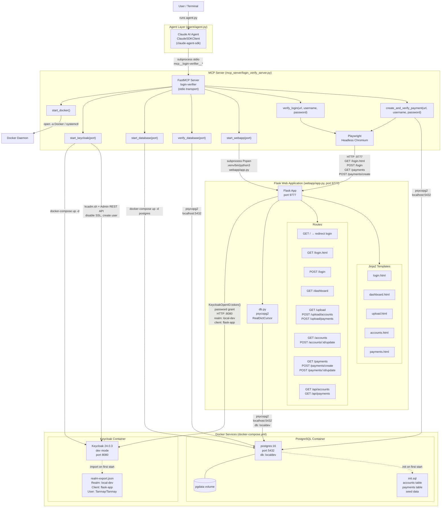

# Architecture Diagram

> Auto-updated by architecture-diagram-updater agent
> Last updated: 2026-02-17

## System Overview



## Component Details

| Component | Port | Technology | Description |
|-----------|------|------------|-------------|
| Claude AI Agent | — | Python, claude-agent-sdk | Orchestrates env validation via ClaudeSDKClient; spawns MCP server as subprocess over stdio |
| MCP Server | stdio | Python, FastMCP (mcp SDK) | Exposes 7 tools for Docker, Keycloak, PostgreSQL, Flask, and payment verification |
| Keycloak | 8080 | quay.io/keycloak/keycloak:24.0.3 | Identity provider; realm `local-dev`, client `flask-app`, test user `Tanmay` |
| PostgreSQL | 5432 | postgres:16 | Relational DB; tables `accounts` and `payments`; volume `pgdata` for persistence |
| Flask Web App | 9777 | Python, Flask, python-keycloak | Session-based web app; validates credentials via Keycloak password grant |
| Playwright | — | Playwright (Chromium headless) | Browser automation used by `verify_login` and `create_and_verify_payment` MCP tools |

## Interaction Summary

### Operational Workflow (agent-driven)

1. **Agent starts**: User runs `agent/agent.py`. The agent spawns `mcp_server/login_verify_server.py` as a subprocess over stdio and connects via `ClaudeSDKClient`.
2. **Docker**: Agent calls `start_docker` — opens Docker Desktop (macOS) or starts via systemctl (Linux).
3. **Keycloak**: Agent calls `start_keycloak(8080)` — runs `docker-compose up -d`, waits up to 60s, then disables SSL on the master realm via `kcadm.sh` inside the container, and provisions the test user `Tanmay` via the Keycloak Admin REST API.
4. **PostgreSQL**: Agent calls `start_database(5432)` — runs `docker-compose up -d postgres`, waits up to 30s. Schema and seed data are applied from `db/init.sql` on the first start.
5. **Database verification**: Agent calls `verify_database(5432)` — connects with psycopg2 and checks row counts in `accounts` and `payments`.
6. **Flask app**: Agent calls `start_webapp(9777)` — spawns `webapp/app.py` as a detached subprocess via `.venv/bin/python3`, polls until healthy.
7. **Login verification**: Agent calls `verify_login(url, "Tanmay", "Tanmay")` — Playwright logs in via the browser, verifies the dashboard is reached.
8. **Payment creation and verification**: Agent calls `create_and_verify_payment(url, "Tanmay", "Tanmay")` — Playwright logs in, navigates to `/payments`, fills the create payment form (`POST /payments/create`, amount=50, USD, debit=1, credit=2), checks for a success message, then queries PostgreSQL directly to confirm the row was persisted.

### Authentication Flow

Browser/Playwright submits credentials to `POST /login` on the Flask app. Flask calls `KeycloakOpenID.token(username, password)` (direct access / password grant) against `http://localhost:8080/realms/local-dev/protocol/openid-connect/token`. On success, Flask sets a server-side session cookie. All subsequent routes are protected by the `@require_login` decorator which checks `session["username"]`.

### Database Schema

```
accounts
  id            SERIAL PK
  name          VARCHAR(100)
  account_type  VARCHAR(50)
  created_at    TIMESTAMP DEFAULT now()
  status        VARCHAR(10)  CHECK (active | inactive)

payments
  id              SERIAL PK
  amount          NUMERIC(15,2)
  currency        VARCHAR(3) DEFAULT 'USD'
  debit_account   INTEGER FK → accounts.id
  credit_account  INTEGER FK → accounts.id
  created_at      TIMESTAMP DEFAULT now()
```

### Flask Route Map

| Method | Path | Auth | Description |
|--------|------|------|-------------|
| GET | `/` | No | Redirect to `/login.html` |
| GET | `/login.html` | No | Render login form |
| POST | `/login` | No | Validate credentials via Keycloak; set session |
| GET | `/dashboard` | Yes | Dashboard page |
| GET | `/upload` | Yes | CSV upload page |
| POST | `/upload/accounts` | Yes | Bulk insert accounts from CSV |
| POST | `/upload/payments` | Yes | Bulk insert payments from CSV |
| GET | `/accounts` | Yes | Search accounts (name, type, status) |
| POST | `/accounts/<id>/update` | Yes | Inline edit account (PRG pattern) |
| GET | `/payments` | Yes | Search payments (currency, amount range) |
| POST | `/payments/create` | Yes | Create single payment from form; redirect to `/payments?created=1` |
| POST | `/payments/<id>/update` | Yes | Inline edit payment (PRG pattern) |
| GET | `/api/accounts` | Yes | JSON API — accounts with search params |
| GET | `/api/payments` | Yes | JSON API — payments with search params |

### MCP Tool Reference

| Tool | Key Action |
|------|-----------|
| `start_docker()` | Opens Docker daemon (macOS: `open -a Docker`; Linux: `systemctl`) |
| `start_keycloak(port)` | `docker-compose up -d`; disables master realm SSL via `kcadm.sh`; provisions test user via Admin REST API |
| `start_database(port)` | `docker-compose up -d postgres`; TCP-polls until ready |
| `verify_database(port)` | psycopg2 connection; queries row counts for `accounts` and `payments` |
| `start_webapp(port)` | Spawns Flask as detached subprocess; HTTP-polls until healthy |
| `verify_login(url, username, password)` | Playwright headless login; checks for "Welcome" in dashboard HTML |
| `create_and_verify_payment(url, username, password)` | Playwright login + `POST /payments/create` form; DB verification via psycopg2 |
